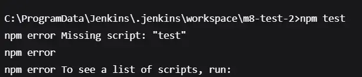
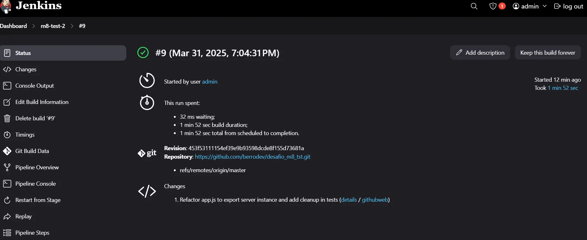
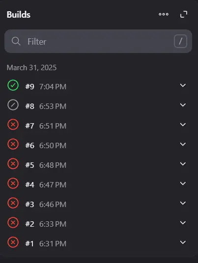

# Reporte de Proyecto

## Pasos Realizados

1. **Inicialización del repositorio local**:
   - Se inicializó el repositorio y se realizó un commit inicial con un archivo `README.md`.
2. **Configuración de la API con Docker**:
   - Se creó un Dockerfile para construir una imagen Docker que ejecuta la API en el puerto 3000.
3. **Configuración de Jenkins**:

   - Se configuró un pipeline de Jenkins para instalar dependencias, ejecutar pruebas y construir la imagen Docker.

4. **Pruebas**:
   - Las pruebas unitarias fueron creadas con Jest y Supertest. El pipeline ejecutó las pruebas con éxito.

## Problemas Encontrados

- **Problema con Git en Windows**: Error para en el archivo Jenkinsfile al intentar ejecutar el comando sh usando Jenkins de forma local en Windows.
  Solución: Se cambió "sh" por "bat".
- **Missing script: "test"**: Error al ejecutar el comando npm test en el pipeline de Jenkins.
  Solución: Se agregó un script de prueba en el package.json.
  

## Build Exitoso

- El pipeline de Jenkins se ejecutó con éxito, construyendo la imagen Docker y ejecutando las pruebas unitarias.
  

## Build Historial

